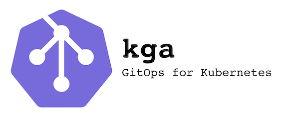

# kga - Kubernetes GitOps App CLI tool

kga is a **CLI tool** to help you **manage your GitOps Kubernetes applications**. It leverages industry standard tools like Kustomize and Helm to enable easier GitOps practices when creating resources for your Kubernetes applications. 

> kga is under active development, we have not finished our entire feature set yet!

## Documentation
[Documentation & Installation instructions](https://kga.greenstatic.dev)

## Features
* 3 different application types:
    * Basic - you define all your manifests and update them by yourself
    * Manifest - provide a URL and version where we can fetch manifests
    * Helm - provide a chart and helm override values and we will build your manifests
* Namespace overrides for manifest apps
* Exclusion of user defined resources
* Manifest URL templating 

## Why is kga Useful?
kga helps you manage the entire life cycle of your application:

1. Initial creation of GitOps application structure
2. Downloading of manifests
3. Overriding and [kustomizing](https://kustomize.io) the application's manifests
4. Static checks for current industry practices
5. Update the applications manifests when a new version is available 

### Typical Workflow:
1. Initialize an app `kga init <type> <app>`
2. Make the necessary changes to the generated `kga.yaml` file
3. Generate the app `kga generate <app>`
4. Make any new changes to your <app\>/overlay
5. Simply use `kustomize build <app>` to get your final manifest ready for deployment
6. If you wish to make any changes, go ahead and change your <app\>/overlay, then just run `kga generate <app>` again

### Demo Creating Kubernetes Dashboard App

## Why Did We Develop kga?
We are firm believers in maintaining applications in Kubernetes by practicing GitOps.
One of the challenges we faced when doing Kubernetes GitOps was the lack of tooling for maintain apps.
This and the number of shell scripts that were difficult to maintain as projects grew bigger made us develop a tool that would ease the process.
